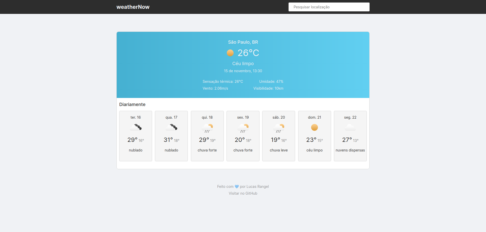

# weatherNow

  

## Sobre

weather é uma aplicação para consulta de clima da região informada pelo usuário, com uma interface que interage com o momento da requisição.

## Tecnologias

Para o desenvolvimento deste projeto foram utilizadas as seguintes tecnologias:

- HTML
- CSS
- JavaScript

---
Desenvolvido com 💙 por [Lucas Rangel](https://www.linkedin.com/in/lucasrngl/)